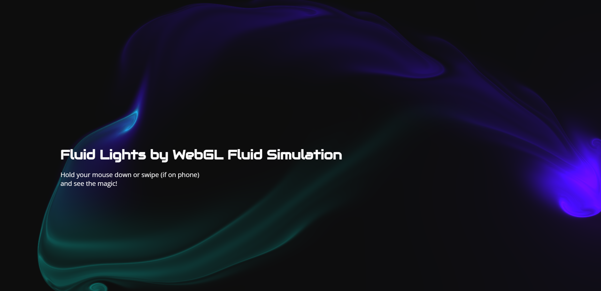

# Fluid-lights

The Fluid Light App is a fun and versatile project inspired by the "webgl fluids" and "PavelDoGreat" projects. It allows users to create stunning fluid light effects on both web browsers and mobile devices. Now you can relax with mesmerizing visuals.

References:
1. https://github.com/PavelDoGreat/WebGL-Fluid-Simulation
2. Playstore - Magic Fluids Lite

